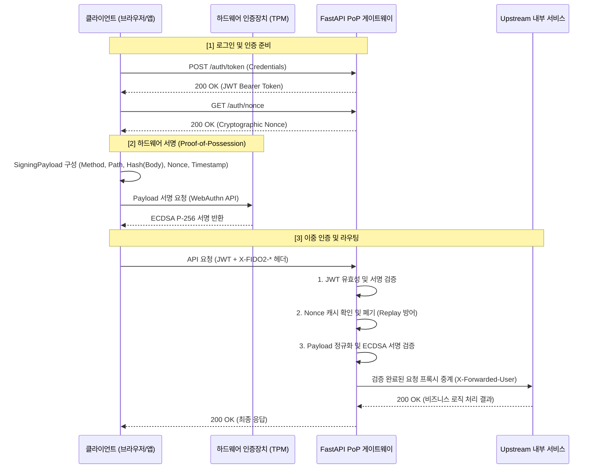

# FIDO2 Proof-of-Possession (PoP) 게이트웨이

## 1. 프로젝트 개요

### 연구 배경

**RFC 6750 Bearer 토큰**은 인증 흐름을 단순화하는 데 효과적이지만, 토큰이 탈취되면(XSS, 브라우저 익스텐션 취약점, 인포스틸러 악성코드 등) 공격자가 제약 없이 재사용할 수 있다는 구조적 한계가 있습니다.

이를 보완하기 위해 애플리케이션 수준의 키 바인딩 기술인 **DPoP (RFC 9449)**이 등장했습니다. 그러나 DPoP도 소프트웨어 기반 키를 사용하므로, 메모리 덤프나 파일 시스템 접근을 통한 개인키 유출 위험을 근본적으로 해소하지 못합니다.

### 연구 목표

본 프로젝트는 **FIDO2/WebAuthn의 하드웨어 격리 키(TPM, Secure Enclave, YubiKey 등)**를 바인딩하여, 세션 하이재킹과 토큰 탈취 공격을 구조적으로 방어하는 경량 리버스 프록시 게이트웨이를 구현하고 성능 타당성을 검증합니다.

---

## 2. 전체 시스템 흐름 및 아키텍처

클라이언트는 HTTP 요청 컨텍스트를 하드웨어 개인키로 서명하여 전송하고, 게이트웨이는 이를 검증한 뒤 내부 서비스(Upstream)로 중계합니다.



### 고부하 및 엔터프라이즈(FAPI) 보안 아키텍처 고도화

최근 업데이트를 통해 단순 순차 처리 구조를 벗어나, 실제 상용(Production) 수준의 동시성 방어 및 보안 표준(FAPI)을 충족하도록 아키텍처가 개선되었습니다.

1. **비동기 논블로킹(Non-blocking) 서명 검증**: 
   - 타원곡선(ECDSA P-256) 검증과 같은 CPU-Bound 연산이 `asyncio` 이벤트 루프를 차단(Block)하지 않도록, `anyio.to_thread`를 활용한 Thread-Pool 위임 구조로 재설계되었습니다. 
   - 결과적으로 다중 스레드 환경에서 GIL 해제 혜택을 받아 초당 처리량(RPS)이 비약적으로 상승했습니다.
2. **O(1) 인그레스 Rate Limiter 최적화**: 
   - IP 기반 초당 10회 요청 제한 로직이 기존 `list.pop(0)` (O(N))에서 `collections.deque.popleft()` (O(1))로 변경되어, 고부하 환경에서의 Thread Lock 경합(Contention) 시간을 상수로 단축시켰습니다.
3. **FAPI 등급 페이로드 바인딩 (Query String 검증)**: 
   - 서명 원문(`canonical_payload`) 생성 시 HTTP Method, Path뿐만 아니라 **Query Parameter를 포함하도록 수정**되었습니다. 공격자가 전송 금액(`?amount=`) 등을 위조해 재전송하는 악의적 공격을 원천 차단합니다.
4. **Zero-Trust 헤더 인젝션 방어**: 
   - 프록시 중계 전 `X-Authenticated-*` 인바운드 헤더를 명시적으로 파기(Drop)하여, 클라이언트의 악의적인 권한 우회(Header Injection) 시도를 방어합니다.

---

## 3. 실측 벤치마크 및 모의 공격 결과 분석

### 모의 공격 시뮬레이션 결과 (`benchmarks/simulate_attack.py`)

- **Baseline (정상 요청)**: 유효한 JWT + FIDO2 하드웨어 서명 조합. → **PASS (200 OK)**
- **Session Hijacking (세션 하이재킹)**: 탈취한 JWT만으로 하드웨어 서명 없이 요청. → **FAIL (401 Unauthorized)**
  - **차단 원리**: PoP 미들웨어가 `X-FIDO2-Signature` 헤더를 필수로 요구합니다. 개인키를 보유하지 않은 공격자는 유효한 서명을 생성할 수 없습니다.
- **Replay Attack (재전송 공격)**: 스니핑으로 캡처한 요청 패킷을 그대로 재전송. → **FAIL (401 Unauthorized)**
  - **차단 원리**: 첫 번째 요청이 처리될 때 Nonce가 즉시 소비(Consume)됩니다. 동일한 Nonce로 재전송된 요청은 캐시 조회에서 실패하여 거부됩니다.

### 정량적 성능 및 페이로드 지표 (`benchmarks/benchmark_latency.py`)

100회 반복 측정 기준 지연 시간(Latency)과 HTTP 헤더 오버헤드입니다.

| 검증 모드 | Mean (평균 지연) | P95 (95백분위 지연) | Payload (헤더 크기) | 상대 오버헤드 |
|---|---|---|---|---|
| **Mode A (표준 JWT 검증)** | 4.29ms | 6.54ms | 0 Bytes | Baseline |
| **Mode B (RSA-2048 PoP)** | 5.86ms | 9.19ms | 499 Bytes | +36.73% |
| **Mode C (ECDSA P-256 PoP)** | 5.39ms | 6.54ms | 252 Bytes | +25.65% |

**기술적 함의 및 하드웨어 시사점**:

1. **페이로드 크기 (RSA vs ECDSA)**: RSA-2048 서명은 256바이트이며 Base64 인코딩 후 약 500바이트의 헤더 오버헤드를 유발합니다. ECDSA P-256 서명은 약 64바이트로, 동일한 보안 강도를 유지하면서 전송 오버헤드를 절반 수준(252 Bytes)으로 줄입니다.

2. **제한된 하드웨어(Constrained Hardware) 환경**: TPM, Secure Enclave, YubiKey와 같은 임베디드 보안 칩셋은 연산 자원과 메모리가 극히 제한되어 있습니다. 이러한 환경에서 RSA-2048은 키 크기와 연산 비용 모두 부담이 크지만, ECDSA P-256은 작은 키·서명 크기와 높은 연산 효율 덕분에 실무 하드웨어 바인딩의 표준으로 자리잡고 있습니다.

---

## 4. 실시간 웹 대시보드 (Interactive Dashboard)

본 프로젝트는 시스템의 보안성 및 성능 최적화 결과를 직관적으로 증명하기 위해 **React + Vite 기반의 실시간 시각화 대시보드**를 제공합니다.

> 🌐 **Live Demo (GitHub Pages):** [https://altdmfk.github.io/fido2-pop-gateway/](https://altdmfk.github.io/fido2-pop-gateway/)

1. **아키텍처 및 공격 시뮬레이터 (Attack Simulator)**
   - **정상 흐름 및 공격 모의**: 대시보드의 버튼을 클릭하여 `정상 요청`, `세션 하이재킹`, `재전송 공격`, `페이로드 변조` 상황을 시뮬레이션할 수 있습니다.
   - **애니메이션 트레이싱**: 클라이언트 $\rightarrow$ TPM $\rightarrow$ Gateway $\rightarrow$ Upstream으로 이어지는 패킷의 이동을 시각적으로 추적합니다.
   - **Fast-Fail 터미널 로그**: 게이트웨이 내부에서 발생하는 5단계 검증 파이프라인(헤더, 타임스탬프, 난수, 다이제스트, 서명 수학 검증)의 동작과 차단 사유를 터미널 형태의 로그로 실시간 출력합니다.

2. **성능 벤치마크 시각화 (Performance Analytics)**
   - **동시성 최적화 차트**: 동기(Sync) 대비 비동기(Async) 전환 후 얻어낸 **처리량 437% 향상(145 $\rightarrow$ 780 RPS)** 및 **지연시간 94% 감소** 지표를 차트로 제공합니다.
   - **페이로드 오버헤드 차트**: RSA-2048 대비 ECDSA P-256 적용 시 얻는 **50% 이상의 대역폭 절감 효과**를 도넛 차트로 비교 분석합니다.

3. **논문 열람 기능**
   - 별도의 다운로드 없이 대시보드 우측 상단의 `[논문 보기]` 버튼을 클릭하여 전체 연구 내용을 즉시 열람할 수 있습니다.

---

## 5. 확장성 한계 및 향후 과제 (Limitations & Future Work)

현재 게이트웨이는 단일 노드(Single-Node) 환경을 전제로 한 프로토타입입니다. 다중 인스턴스 운용을 위해서는 다음 사항을 고려해야 합니다.

1. **상태 관리의 분산화 (Distributed State Management)**: Nonce 캐시(`nonce_store.py`)와 Rate Limiter(`rate_limiter.py`)는 현재 `threading.Lock` 기반의 인메모리 자료구조를 사용하며, 단일 프로세스 범위 내에서만 일관성을 보장합니다. 로드 밸런서 뒤에 여러 게이트웨이 인스턴스를 배치하려면 상태 저장소를 **Redis Cluster** 같은 분산 인메모리 데이터베이스로 이관해야 합니다.

2. **원자적 Nonce 소비 (Atomic Nonce Consumption)**: 다중 노드 환경에서는 Nonce 조회와 삭제 사이에 Race Condition이 발생할 수 있습니다. Redis의 **Lua 스크립트**를 사용하여 `GET`과 `DEL`을 하나의 원자적 연산으로 처리하면, 중복 소비를 방지하고 재전송 공격에 대한 보장을 유지할 수 있습니다.

---

## 6. 로컬 실행 및 검증 매뉴얼 (Local Execution & Verification)

### 환경 설정 및 서버 구동

프로젝트 루트 디렉토리(`pop-token-gateway/`)에서 다음 명령어를 실행합니다.

```cmd
:: 1. 가상환경 활성화
.venv\Scripts\activate.bat

:: 2. 패키지 설치
pip install -r requirements.txt

:: 3. 게이트웨이 및 Upstream 서버 구동 (터미널 2개 사용 권장)
:: 터미널 A (Upstream Server):
python -m uvicorn upstream.mock_server:app --host 127.0.0.1 --port 8080

:: 터미널 B (Gateway Server):
python -m uvicorn app.main:app --host 127.0.0.1 --port 8000

:: 4. 시각화 대시보드 구동 (Frontend)
:: 터미널 C (Frontend Dashboard):
cd frontend
npm install
npm run dev
:: 브라우저에서 http://localhost:5173 에 접속하여 실시간 아키텍처 및 공격 시뮬레이터를 확인하세요.
```

### 테스트 및 벤치마크 실행

새로운 터미널을 열고 가상환경을 활성화한 뒤 아래 명령어를 실행합니다.

```cmd
:: 1. 단위 및 통합 테스트 수행
pytest tests/ -v

:: 2. 모의 공격 시뮬레이션
python -m benchmarks.simulate_attack

:: 3. 지연 시간 벤치마크 측정
python -m benchmarks.benchmark_latency
```

### 동시성 부하 테스트 실행 (Locust)

단순 지연 시간 측정이 아닌 동시 접속 환경에서의 고부하 성능(TPS)을 검증하려면 `Locust`를 이용한 분산 테스트를 진행합니다. 매 요청마다 ECDSA 서명을 생성해야 하므로, 반드시 다수의 워커를 실행해야 클라이언트 병목을 피할 수 있습니다.

```cmd
:: 1. 부하 테스트용 의존성 설치
pip install locust cryptography

:: 2. 마스터 프로세스 실행 (터미널 A)
cd benchmarks
locust -f locustfile.py --master

:: 3. 워커 프로세스 실행 (터미널 B, C... CPU 코어 수만큼 실행)
cd benchmarks
locust -f locustfile.py --worker
```

**테스트 시작 방법:**
- 브라우저에서 `http://localhost:8089`에 접속합니다.
- **Number of users**: `1000` (예시)
- **Spawn rate**: `50` (초당 생성 유저 수)
- **Host**: `http://localhost:8000` (게이트웨이 주소)
- **Start swarming**을 눌러 부하 테스트를 시작합니다. 
> 💡 *참고: 본 테스트는 Nonce 발급과 실제 API 호출을 묶어서 1개의 Task로 처리하므로, 게이트웨이가 실제 처리하는 초당 요청 수(RPS)는 Locust 대시보드 수치의 2배입니다.*

---

## 7. 주요 산출물 및 연구 검증 문서 (`docs/`)

본 연구 프로젝트의 신뢰성과 재현성을 입증하기 위해 작성된 핵심 보고서 및 산출물 목록입니다.

| 파일 경로 | 구분 | 설명 |
|---|---|---|
| **[`docs/verification.md`](docs/verification.md)** | **연구 검증 보고서** | **가설 수립부터 5단계 실증 검증(가설 설정, 선행연구 분석, 실험 설계, 결과 해석, AI 협업 기록)까지 전 과정을 체계적으로 기술한 핵심 검증 문서** |
| **[`docs/paper.md`](docs/paper.md)** | 국문 연구 논문 | 학술 논문 양식의 FIDO2 PoP 게이트웨이 설계 및 성능 분석 국문 전문 (표지 정보 포함) |
| **[`docs/paper_en.md`](docs/paper_en.md)** | 영문 연구 논문 | 글로벌 배포 및 웹 대시보드 연동용 영문 전문 (Cover 정보 포함) |
| **`docs/FIDO2_PoP_Gateway.docx`** | 공식 제출 논문 | 제출용 국문 논문 서식 문서 (표지, 작성자: 강아름, 작성일 포함) |
| **`docs/FIDO2_PoP_Gateway_EN.docx`** | 공식 제출 논문 | 제출용 영문 논문 서식 문서 (Cover, Author: Ahrum Kang, Date 포함) |
| **`docs/benchmark_results.json`** | 벤치마크 원자료 | 3가지 검증 모드(JWT, RSA, ECDSA) 100회 반복 측정 지연시간 및 페이로드 Raw 데이터 |
| **`docs/cs_security_deep_dive_ko.md`** | 보안 심층 분석 | 컴퓨터공학 관점의 토큰 탈취 취약점 및 FIDO2 보안 심층 분석서 |

