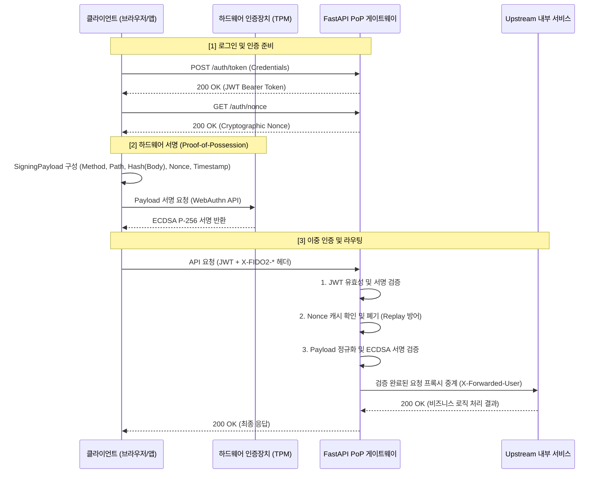

# FIDO2 Proof-of-Possession (PoP) 게이트웨이

## 1. 프로젝트 개요

### 연구 배경

**RFC 6750 Bearer 토큰**은 인증 흐름을 단순화하는 데 효과적이지만, 토큰이 탈취되면(XSS, 브라우저 익스텐션 취약점, 인포스틸러 악성코드 등) 공격자가 제약 없이 재사용할 수 있다는 구조적 한계가 있습니다.

이를 보완하기 위해 애플리케이션 수준의 키 바인딩 기술인 **DPoP (RFC 9449)**이 등장했습니다. 그러나 DPoP도 소프트웨어 기반 키를 사용하므로, 메모리 덤프나 파일 시스템 접근을 통한 개인키 유출 위험을 근본적으로 해소하지 못합니다.

### 연구 목표

본 프로젝트는 **FIDO2/WebAuthn의 하드웨어 격리 키(TPM, Secure Enclave, YubiKey 등)**를 바인딩하여, 세션 하이재킹과 토큰 탈취 공격을 구조적으로 방어하는 경량 리버스 프록시 게이트웨이를 구현하고 성능 타당성을 검증합니다.

---

## 2. 전체 시스템 흐름 및 아키텍처

클라이언트는 HTTP 요청 컨텍스트를 하드웨어 개인키로 서명하여 전송하고, 게이트웨이는 이를 검증한 뒤 내부 서비스(Upstream)로 중계합니다.



### 아키텍처 방어 계층 (Dual-Layer DoS Defense)

`/auth/nonce` 엔드포인트는 자원 고갈 공격(DoS)에 대비하여 두 가지 방어 계층을 운용합니다.

1. **L7 Ingress Flooding Mitigation (Rate Limiting)**: 클라이언트 IP 기준으로 초당 10회(10 req/s)를 초과하는 요청이 들어오면 `429 Too Many Requests`를 반환하고 처리를 즉시 중단합니다. 단기 폭증 트래픽으로부터 CPU 자원을 보호하는 첫 번째 방어선입니다.
2. **State Accumulation Prevention (Storage TTL)**: 정상 발급된 난수라도 60초 TTL이 지나면 백그라운드 GC가 상태 저장소(`nonce_store.py`)에서 삭제합니다. 장기적인 메모리 누적을 방지하는 두 번째 방어선입니다.

---

## 3. 실측 벤치마크 및 모의 공격 결과 분석

### 모의 공격 시뮬레이션 결과 (`benchmarks/simulate_attack.py`)

- **Baseline (정상 요청)**: 유효한 JWT + FIDO2 하드웨어 서명 조합. → **PASS (200 OK)**
- **Session Hijacking (세션 하이재킹)**: 탈취한 JWT만으로 하드웨어 서명 없이 요청. → **FAIL (401 Unauthorized)**
  - **차단 원리**: PoP 미들웨어가 `X-FIDO2-Signature` 헤더를 필수로 요구합니다. 개인키를 보유하지 않은 공격자는 유효한 서명을 생성할 수 없습니다.
- **Replay Attack (재전송 공격)**: 스니핑으로 캡처한 요청 패킷을 그대로 재전송. → **FAIL (401 Unauthorized)**
  - **차단 원리**: 첫 번째 요청이 처리될 때 Nonce가 즉시 소비(Consume)됩니다. 동일한 Nonce로 재전송된 요청은 캐시 조회에서 실패하여 거부됩니다.

### 정량적 성능 및 페이로드 지표 (`benchmarks/benchmark_latency.py`)

100회 반복 측정 기준 지연 시간(Latency)과 HTTP 헤더 오버헤드입니다.

| 검증 모드 | Mean (평균 지연) | P95 (95백분위 지연) | Payload (헤더 크기) | 상대 오버헤드 |
|---|---|---|---|---|
| **Mode A (표준 JWT 검증)** | 4.03ms | 7.28ms | 0 Bytes | Baseline |
| **Mode B (RSA-2048 PoP)** | 4.87ms | 7.25ms | 499 Bytes | +20.96% |
| **Mode C (ECDSA P-256 PoP)** | 4.88ms | 6.20ms | 252 Bytes | +21.19% |

**기술적 함의 및 하드웨어 시사점**:

1. **페이로드 크기 (RSA vs ECDSA)**: RSA-2048 서명은 256바이트이며 Base64 인코딩 후 약 500바이트의 헤더 오버헤드를 유발합니다. ECDSA P-256 서명은 약 64바이트로, 동일한 보안 강도를 유지하면서 전송 오버헤드를 절반 수준(252 Bytes)으로 줄입니다.

2. **제한된 하드웨어(Constrained Hardware) 환경**: TPM, Secure Enclave, YubiKey와 같은 임베디드 보안 칩셋은 연산 자원과 메모리가 극히 제한되어 있습니다. 이러한 환경에서 RSA-2048은 키 크기와 연산 비용 모두 부담이 크지만, ECDSA P-256은 작은 키·서명 크기와 높은 연산 효율 덕분에 실무 하드웨어 바인딩의 표준으로 자리잡고 있습니다.

---

## 4. 확장성 한계 및 향후 과제 (Limitations & Future Work)

현재 게이트웨이는 단일 노드(Single-Node) 환경을 전제로 한 프로토타입입니다. 다중 인스턴스 운용을 위해서는 다음 사항을 고려해야 합니다.

1. **상태 관리의 분산화 (Distributed State Management)**: Nonce 캐시(`nonce_store.py`)와 Rate Limiter(`rate_limiter.py`)는 현재 `threading.Lock` 기반의 인메모리 자료구조를 사용하며, 단일 프로세스 범위 내에서만 일관성을 보장합니다. 로드 밸런서 뒤에 여러 게이트웨이 인스턴스를 배치하려면 상태 저장소를 **Redis Cluster** 같은 분산 인메모리 데이터베이스로 이관해야 합니다.

2. **원자적 Nonce 소비 (Atomic Nonce Consumption)**: 다중 노드 환경에서는 Nonce 조회와 삭제 사이에 Race Condition이 발생할 수 있습니다. Redis의 **Lua 스크립트**를 사용하여 `GET`과 `DEL`을 하나의 원자적 연산으로 처리하면, 중복 소비를 방지하고 재전송 공격에 대한 보장을 유지할 수 있습니다.

---

## 5. 로컬 실행 및 검증 매뉴얼 (Local Execution & Verification)

### 환경 설정 및 서버 구동

프로젝트 루트 디렉토리(`pop-token-gateway/`)에서 다음 명령어를 실행합니다.

```cmd
:: 1. 가상환경 활성화
.venv\Scripts\activate.bat

:: 2. 패키지 설치
pip install -r requirements.txt

:: 3. 게이트웨이 및 Upstream 서버 구동 (데몬/백그라운드 제외, 터미널 2개 사용 권장)
:: 터미널 A (Upstream Server):
python -m uvicorn upstream.mock_server:app --host 127.0.0.1 --port 8080

:: 터미널 B (Gateway Server):
python -m uvicorn app.main:app --host 127.0.0.1 --port 8000
```

### 테스트 및 벤치마크 실행

새로운 터미널을 열고 가상환경을 활성화한 뒤 아래 명령어를 실행합니다.

```cmd
:: 1. 단위 및 통합 테스트 수행
pytest tests/ -v

:: 2. 모의 공격 시뮬레이션
python -m benchmarks.simulate_attack

:: 3. 지연 시간 벤치마크 측정
python -m benchmarks.benchmark_latency
```
