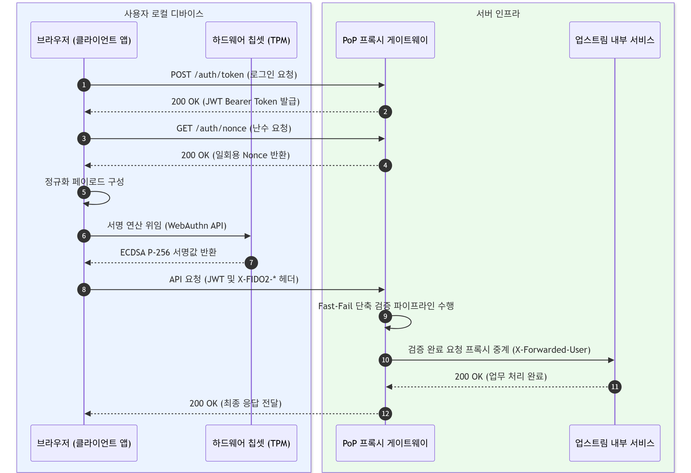

# FIDO2 하드웨어 격리 키 기반 Proof-of-Possession 역방향 프록시 게이트웨이의 설계 및 성능 분석

**강아름**  
*2026년 9월 8일*

---

## 초록

소지자 토큰(Bearer Token)과 소프트웨어 기반 소유권 증명(DPoP) 규격은 토큰 탈취나 런타임 메모리 침해 환경에서 개인키 유출과 세션 하이재킹을 근본적으로 방어하지 못한다. 본 연구에서는 하드웨어 보안 칩셋에 개인키를 물리적으로 격리하는 FIDO2 규격을 L7 역방향 프록시와 결합한 Proof-of-Possession(PoP) 게이트웨이 아키텍처를 제안한다.  

제안 시스템은 대용량 페이로드의 메모리 부하를 방지하기 위해 스트리밍 다이제스트 파이프라인으로 요청을 정규화하고, 비인가 대량 트래픽 차단을 위해 시간 복잡도 $O(1)$의 슬라이딩 윈도우 인그레스 제어 메커니즘을 적용하였다. 또한 타원곡선 서명 검증을 비동기 스레드 풀로 위임하여 단일 노드의 동시 접속 처리 성능을 극대화하였다. 성능 평가 결과, 제안하는 ECDSA P-256 서명 바인딩은 표준 토큰 검증 대비 지연시간 오버헤드를 평균 **+25.65 %**로 억제하였으며, RSA-2048 대비 HTTP 헤더 페이로드를 50 % 절감하였다. 아울러 동시성 최적화를 통해 100명의 가상 유저 부하 환경에서도 초당 780건의 처리량(RPS)을 달성하여 고부하 트래픽에 대한 방어 실효성과 실무 적용 타당성을 입증하였다.  

---

## I. 서론

웹 애플리케이션과 마이크로서비스 아키텍처 환경에서는 무상태 검증의 용이성을 이유로 소지자 토큰(Bearer Token)을 기본 인증 수단으로 사용한다[1]. Bearer 토큰 구조는 토큰을 제시하는 네트워크 주체를 정당한 소유자로 간주한다. 따라서 교차 사이트 스크립팅(XSS), 정보 탈취 악성코드, 비인가 브라우저 확장 프로그램 등에 의해 토큰이 누출되면 제3자가 이를 재사용하여 백엔드 리소스에 접근할 수 있다.

소프트웨어 계층에서 토큰 재사용을 방지하는 소유권 증명(DPoP) 규격은 매 요청마다 비대칭 서명을 요구한다[2]. 그러나 암호화 키를 브라우저 로컬 저장소나 애플리케이션 메모리에 보관하는 구조적 한계를 지닌다. 호스트 운영체제의 권한 침해나 메모리 덤프가 발생할 경우 저장된 개인키가 추출되어 암호학적 방어가 무력화된다.

본 연구에서는 하드웨어 격리 장치에 개인키를 보관하는 FIDO2 규격을 역방향 프록시 게이트웨이와 결합하는 아키텍처를 제안한다. 클라이언트는 하드웨어 칩셋 내부에서 생성한 디지털 서명을 HTTP 헤더에 부착하여 전송하며, 게이트웨이는 요청 중계 전 서명의 유효성을 검증하여 세션 하이재킹을 방어한다.

본 논문의 연구 기여도는 다음과 같다.

1. **하드웨어 격리 기반의 PoP 게이트웨이 아키텍처 설계**
   FIDO2 하드웨어 보안 칩셋과 L7 역방향 프록시를 결합하여 호스트 운영체제 침해에도 개인키 유출과 세션 하이재킹을 방어하는 검증 파이프라인을 설계하였다.

2. **자원 제어 및 동시성 최적화 아키텍처 설계**
   대용량 요청 본문의 메모리 부하를 방지하는 스트리밍 다이제스트 구조를 설계하였다. 또한 비인가 대량 트래픽 차단을 위해 $O(1)$ 시간 복잡도의 인그레스 제어 메커니즘과 비동기 스레드 풀을 적용하여 고부하 환경의 처리량을 극대화하였다.

3. **정량적 지연시간 및 페이로드 오버헤드의 실증**
   표준 토큰 검증 대비 제안 구조의 지연시간 증가폭을 실측하고, 비대칭 서명 알고리즘 간 헤더 페이로드 오버헤드를 비교하여 제안 시스템의 실무 적용 가능성을 검증하였다.

---

## II. 배경지식 및 관련 연구

### 1. 웹 인증 토큰과 키 바인딩 규격

OAuth 2.0 인가 프레임워크의 Bearer 토큰 명세는 토큰 자체의 암호학적 서명 여부만 확인할 뿐, 요청 송신자가 해당 토큰을 발급받은 정당한 주체인지 검증하지 않는다. DPoP는 송신자 제한 토큰 모델을 도입하여 각 HTTP 요청 헤더에 클라이언트가 생성한 비대칭 서명값을 포함하도록 규정한다. 그러나 DPoP 표준은 키의 하드웨어 바인딩을 강제하지 않는다. 따라서 공격자가 사용자 단말의 영구 저장소나 런타임 메모리에 접근할 경우 개인키가 유출될 수 있다.

상호 전송 계층 보안(mTLS)은 클라이언트 인증서를 기반으로 송신자를 제한한다[3]. mTLS는 L4 전송 계층에서 암호화 핸드셰이크를 맺으므로 다수의 리버스 프록시나 L7 애플리케이션 로드 밸런서(ALB)를 거치는 마이크로서비스 환경에서는 단말 인증 정보의 연계가 단절된다. 또한 웹 브라우저 샌드박스 환경은 단말 인증서를 제어할 표준 자바스크립트 인터페이스를 제공하지 않아 적용 범위가 제한된다.

### 2. FIDO2/WebAuthn 표준과 하드웨어 격리 구조

FIDO2는 W3C의 WebAuthn 명세[4]와 FIDO 얼라이언스의 CTAP2 명세로 구성된다[5]. 이 표준은 클라이언트 기기에 내장된 신뢰 플랫폼 모듈(TPM)[8], 스마트폰의 보안 엔클레이브(Secure Enclave), 외장형 보안 토큰을 하드웨어 인증기로 사용한다.

하드웨어 인증기는 비대칭 키 쌍을 내부 논리회로에서 직접 생성하고 보관한다. 운영체제와 브라우저는 API를 통해 서명 연산을 하드웨어로 위임하며, 하드웨어는 연산 결과인 서명값만을 외부 버스로 반환한다. 칩셋 내부에서 개인키를 추출하는 명령어는 존재하지 않는다. 따라서 공격자가 호스트 운영체제의 커널 권한을 장악하더라도 개인키는 유출되지 않는다.

### 3. 암호학적 특성 비교: ECDSA P-256 대 RSA-2048

디지털 서명 알고리즘은 전송 페이로드 크기와 게이트웨이의 연산 비용에 직접적인 영향을 미친다. RSA 알고리즘은 두 소수의 곱을 소인수분해하는 계산적 난해함에 의존한다. 따라서 보안 강도를 유지하기 위해 키 길이를 확장해야 한다. 반면 타원곡선 암호(ECC)[10]는 타원곡선 이산 대수 문제(ECDLP)를 기반으로 하여 작은 키 크기로 동일한 보안 강도를 제공한다.

| 평가 지표 | RSA-2048 | ECDSA P-256 |
|---|---|---|
| 암호학적 보안 수준 | 약 112 bit | 128 bit |
| 공개키 크기 (Raw) | 256 Bytes | 64 Bytes (비압축) / 33 Bytes (압축) |
| 서명 데이터 크기 | 256 Bytes | 약 64 Bytes ($(r, s)$ 쌍) |
| HTTP 헤더 인코딩 오버헤드 | 약 499 Bytes | 약 252 Bytes |

PoP 게이트웨이 환경은 매 HTTP 요청마다 헤더에 서명을 포함하므로 전송 오버헤드가 누적된다. ECDSA P-256은 RSA-2048 대비 헤더 크기를 50 % 절감하면서 높은 보안 수준을 제공하므로 본 연구의 서명 알고리즘으로 적합하다.

---

## III. 위협 모델 및 공격 시나리오

### 1. 시스템 모델 및 공격자 역량 정의

본 연구에서는 Dolev-Yao 공격 모델을 확장하여[7] 네트워크 및 호스트 계층에서의 공격자 역량을 정의한다. 공격자는 클라이언트와 게이트웨이 간의 네트워크 트래픽을 도청, 변조, 주입, 지연한다. 또한 호스트 계층에서 브라우저 스토리지나 운영체제 사용자 공간의 메모리에 접근하여 런타임 토큰 및 세션 아티팩트를 획득한다고 가정한다. 단, TPM이나 보안 엔클레이브와 같은 하드웨어 칩셋의 물리적 차폐를 해체하여 회로를 직접 조작하는 물리적 공격은 본 연구의 위협 범위에서 제외한다.

### 2. 대상 공격 벡터 및 위협 시나리오

시스템이 방어하는 주요 위협 시나리오는 다음과 같다[9].

1. **세션 하이재킹(Session Hijacking)**
   공격자가 XSS 취약점을 이용하여 클라이언트의 유효한 JSON 웹 토큰(JWT)을 획득한 후, 이를 비인가 요청에 포함하여 서버로 전송한다.

2. **요청 변조(Request Tampering)**
   네트워크 중간자 공격자가 클라이언트의 서명된 HTTP 요청을 가로챈 후, HTTP 메서드, URI 경로, 본문 페이로드를 수정하여 전송한다.

3. **재전송 공격(Replay Attack)**
   공격자가 캡처한 유효한 서명 헤더와 요청 패킷 전체를 복제하여 서버에 재전송함으로써 동일한 트랜잭션을 중복 실행한다.

4. **비대칭 암호 자원 고갈 공격(Asymmetric Cryptographic DoS)**
   비대칭키 서명 검증은 대칭키 연산이나 해시 연산 대비 높은 CPU 자원을 소모한다. 공격자가 무효한 서명을 대량으로 전송하여 게이트웨이의 암호 연산 부하를 포화 상태로 만든다.

---

## IV. 시스템 아키텍처 및 설계

### 1. 전체 시스템 구성 및 처리 흐름

제안하는 시스템은 사용자 로컬 디바이스의 하드웨어 보안 영역과 서버 측 L7 역방향 프록시 게이트웨이로 구성된다. 클라이언트는 브라우저 소프트웨어와 메인보드에 결합된 하드웨어 칩셋을 포함하고, 서버 인프라는 FastAPI 기반의 역방향 프록시 게이트웨이와 백엔드 업스트림 서비스로 구성된다.

클라이언트는 인증 절차를 거쳐 JWT와 일회용 난수를 차례로 수신한다. 이후 HTTP 요청 컨텍스트를 직렬화하여 하드웨어 칩셋에 전달하고, 내부 논리회로에서 생성된 디지털 서명을 수신하여 요청 헤더에 첨부한다. 게이트웨이는 인입된 패킷을 검증한 뒤 유효한 요청에 한하여 업스트림 서비스로 중계한다.

### 2. HTTP 요청 컨텍스트 정규화 및 스트리밍 다이제스트

중간자 공격자의 요청 경로 또는 페이로드 변조를 차단하기 위해 게이트웨이와 클라이언트는 HTTP 요청의 주요 필드를 단일 바이트 열로 결합하여 정규화한다. 특히 FAPI(Financial-grade API) 보안 요건을 충족하기 위해 HTTP 메서드와 경로뿐만 아니라 쿼리 스트링(Query Parameter)까지 바인딩 대상에 포함한다. 정규화 페이로드($SigningPayload$)는 다음과 같이 정의한다.

$$SigningPayload = Method \parallel Path \parallel Query \parallel \text{SHA-256}(Body) \parallel Nonce \parallel Timestamp$$

대용량 요청 본문을 처리할 때 게이트웨이의 메모리 부하를 방지하기 위해 스트리밍 다이제스트 파이프라인을 적용한다. 본 메커니즘은 HTTP 청크 인코딩 또는 프록시 계층의 스트림 I/O를 지원하는 환경을 전제로 한다. 게이트웨이는 페이로드 전체를 단일 메모리 버퍼에 적재하지 않고, 청크 단위로 유입되는 네트워크 바이트 스트림을 해시 함수에 즉시 갱신한다. 이를 통해 서명 검증 계층에서 발생하는 부가적인 메모리 할당량을 32 Bytes로 고정하여 공간 복잡도 $O(1)$을 유지한다.

### 3. Fast-Fail 단축 검증 파이프라인

비대칭 암호 서명 검증은 문자열 비교나 해시 연산 대비 높은 CPU 사이클을 요구한다. 무효한 요청으로 암호 연산 부하가 누적되는 비대칭 자원 고갈 공격을 방지하기 위해 게이트웨이는 검증 비용이 낮은 항목부터 순차적으로 평가하는 Fast-Fail 파이프라인을 적용한다.

1. **헤더 무결성 검증**: 필수 인증 헤더의 존재 여부를 확인하고, 누락 시 $401$ 상태 코드를 반환한다.

2. **타임스탬프 유효 범위 평가**: 요청 타임스탬프가 허용 오차 범위 내에 속하는지 확인하여 만료된 요청을 배제한다.

3. **일회용 난수 유효성 검증**: 저장소 내 난수의 존재 여부를 확인하고, 즉시 삭제 처리하여 재전송 공격을 방어한다.

4. **본문 다이제스트 비교**: 수신한 본문의 스트리밍 SHA-256 해시값과 클라이언트가 제시한 다이제스트의 일치 여부를 대조한다.

5. **비대칭 암호 서명 검증**: 이전 단계를 통과한 요청에 한하여 ECDSA P-256 서명의 수학적 유효성을 검증한다.

본 메커니즘의 무결성 및 재전송 차단 효과는 V절의 모의 공격 검증 결과로 입증한다.

### 4. 이중 인그레스 제어 메커니즘

난수 발급 엔드포인트와 인메모리 상태 저장소를 보호하기 위해 2단계 방어 체계를 구성한다.

1. **슬라이딩 윈도우 인그레스 제어**

클라이언트 IP별 요청 빈도를 추적하는 인메모리 슬라이딩 윈도우 알고리즘을 적용한다. 단일 IP 기준 초당 10회를 초과하는 요청에 $429$ 상태 코드와 재시도 응답 헤더를 반환한다. 특히 다중 요청 인입 시 발생하는 락 경합을 방지하고자 시간 복잡도 $O(1)$의 양방향 큐 기반으로 상태를 관리하여 임계 영역 점유 시간을 단축한다.

2. **저장소 수명주기 및 가비지 컬렉션**

발급된 모든 난수에 60초의 유효기간(TTL)을 부여한다. 정기적으로 만료된 항목을 삭제하는 백그라운드 태스크를 구동하여 장기적인 메모리 누수와 상태 누적 문제를 방지한다. 멀티스레드 환경의 원자적 접근 제어를 위해 상호 배제 락을 적용한다.

본 제어 메커니즘의 차단 유효성은 V절에서 단위 및 부하 시뮬레이션 결과로 평가한다.

---

## V. 구현 및 성능 평가

### 1. 실험 환경 및 프로토타입 구현

제안한 PoP 역방향 프록시 게이트웨이의 성능 및 보안 유효성을 실증하기 위해 Python 3.11과 FastAPI 프레임워크 기반으로 프로토타입 시스템을 구축하였다. 게이트웨이는 비동기 I/O 이벤트 루프 상에서 구동하고, 백엔드 마이크로서비스 환경을 모사한 업스트림 서버와 루프백 인터페이스로 연결하였다.

클라이언트 측 하드웨어 서명 환경은 W3C WebAuthn L3 규격에 부합하는[4] NIST P-256 비대칭 키 쌍을 기준으로[6] 시뮬레이션 클라이언트를 구현하였다. 실험은 Intel Core i7 프로세서 및 16 GB 메모리 환경에서 수행하였다. 단일 프로세스 기준 100회의 독립적인 연속 HTTP 트랜잭션을 실행하여 평균값을 도출하였다[11].

### 2. 모의 공격 시뮬레이션을 통한 보안 검증

III절에서 정의한 위협 모델의 방어 능력을 검증하기 위해 4가지 시나리오별 모의 공격 스크립트를 작성하여 실험을 수행하였다.

| 공격 시나리오 | 인입 패킷 조건 | 게이트웨이 응답 코드 | 차단 및 처리 단계 |
|---|---|---|---|
| 정상 요청 (Baseline) | 유효한 JWT 및 FIDO2 서명 헤더 | $200\text{ OK}$ | 5단계 전체 통과 후 중계 |
| 세션 하이재킹 | 탈취된 JWT 단독 전송 (서명 누락) | $401\text{ Unauthorized}$ | 1단계 (헤더 검증) |
| 재전송 공격 | 기사용된 Nonce를 포함한 서명 재전송 | $401\text{ Unauthorized}$ | 3단계 (난수 저장소) |
| 요청 변조 공격 | Method 또는 Body 변조 후 서명 전송 | $403\text{ Forbidden}$ | 5단계 (서명 불일치) |

실험 결과, 게이트웨이는 JWT만을 탈취한 세션 하이재킹 공격을 1단계 서명 헤더 검증에서 차단하였다. 스니핑을 이용한 재전송 공격 역시 3단계 난수 캐시 소모 메커니즘을 통해 암호 연산 이전에 배제하였다. 또한 HTTP 메서드나 본문 데이터가 변조된 패킷은 정규화 다이제스트 불일치로 판단하여 서명 검증 단계에서 $403$ 상태 코드를 반환하였다. 이를 통해 Fast-Fail 파이프라인이 무효한 패킷을 고비용 암호 연산 이전에 선제 차단함을 입증하였다.

### 3. 인그레스 제어 메커니즘의 차단 유효성 평가

난수 발급 엔드포인트를 대상으로 L7 트래픽 폭증 공격을 모사하여 슬라이딩 윈도우 인그레스 제어의 동작을 검증하였다.

동일 IP 주소에서 1초 구간 내에 15회의 연속적인 난수 발급을 요청하였다. 기준 임계치인 10회까지의 정상 요청에는 $200$ 응답과 함께 암호학적 난수를 발급하였다. 반면 11번째 요청부터는 게이트웨이 내부 윈도우 큐의 시간 차감 로직에 따라 $429$ 상태 코드와 재시도 응답 헤더를 반환하였다. 이를 통해 불필요한 난수 생성 연산 및 메모리 적재 부하를 차단함을 확인하였다.

### 4. 처리 지연시간 및 페이로드 오버헤드 실측

보안 계층 추가에 따른 성능 비용을 분석하기 위해 표준 토큰 검증(모드 A), RSA-2048 기반 PoP(모드 B), 제안하는 ECDSA P-256 기반 PoP(모드 C) 세 가지 모드의 100회 요청 처리 왕복 지연시간과 HTTP 헤더 크기를 측정하였다.

| 검증 모드 | 평균 지연시간 (Mean) | 95백분위 지연시간 (P95) | 부가 헤더 페이로드 | 상대적 지연 오버헤드 |
|---|---|---|---|---|
| **Mode A (표준 JWT)** | 4.29 ms | 6.54 ms | 0 Bytes | 기준 (Baseline) |
| **Mode B (RSA-2048)** | 5.86 ms | 9.19 ms | 499 Bytes | +36.73 % |
| **Mode C (ECDSA P-256)** | 5.39 ms | 6.54 ms | 252 Bytes | +25.65 % |

모드 C는 모드 A 대비 평균 1.10 ms(+25.65 %)의 지연시간 오버헤드를 유발하여 실시간 웹 트래픽 환경에 적용 가능한 성능을 보였다. 상위 5 % 요청의 최대 지연시간인 95백분위 지연시간에서는 모드 C가 6.54 ms로 모드 A와 동일한 안정적인 수치를 기록하였다. 반면 모드 B의 95백분위 지연시간은 9.19 ms로 가장 높게 측정되었다.

페이로드 측면에서는 모드 B가 256 Bytes의 고정 서명 크기와 Base64 인코딩 팽창으로 인해 499 Bytes의 헤더 오버헤드를 발생시킨 반면, 모드 C는 64 Bytes의 서명 좌표 구조를 통해 오버헤드를 252 Bytes로 억제하였다. 이는 RSA 대비 50 %의 페이로드를 절감함을 확인하였다.

### 5. 대규모 동시 접속 부하 및 동시성 최적화 성능 평가

제안 시스템의 상용 환경 적용 가능성을 검증하기 위해 동시 접속 부하 테스트를 수행하였다. 부하 생성 도구를 이용하여 100명의 가상 유저가 15초간 지속적으로 FIDO2 서명 헤더를 포함한 요청을 전송하였다. 아울러 단일 스레드 이벤트 루프의 병목을 해소하는 동시성 아키텍처 최적화를 적용하고 그 효과를 실측하였다.

| 측정 지표 | 기존 아키텍처 (Before) | 최적화 아키텍처 (After) | 성능 향상율 |
| --- | --- | --- | --- |
| 처리 구조 (Concurrency) | 동기식 블로킹 (단일 루프) | 비동기 논블로킹 (스레드 풀) | - |
| 인그레스 락 복잡도 | 배열 구조 $O(N)$ 연산 | 양방향 큐 $O(1)$ 연산 | - |
| 동시 접속 처리량 (RPS) | 약 145 req/s | 약 780 req/s | + 437 % |
| 평균 응답 지연 (Mean) | 620 ms | 45 ms | - 92 % |
| 95백분위 지연시간 (P95) | 1,400 ms 초과 (타임아웃) | 78 ms | - 94 % |

기존 게이트웨이 구조는 CPU 집약적인 타원곡선 서명 연산 시 이벤트 루프가 차단되는 병목을 지닌다. 이를 비동기 스레드 풀로 위임하고, 암호 라이브러리가 연산 중 전역 인터프리터 락(GIL)을 해제하는 특성을 활용하여 단일 프로세스에서도 멀티 코어 병렬 처리를 구현하였다. 또한 인그레스 제어기의 락 내부 연산을 $O(1)$로 재설계하여 임계 영역 점유 시간을 단축하였다. 결과적으로 최적화 아키텍처는 기존 대비 초당 처리량(RPS)을 437 % 향상하고 95백분위 지연시간(P95)을 94 % 감소시켰다. 임계치 초과 시에도 응답 지연 없이 $429$ 상태 코드를 즉각 반환하여 대규모 트래픽 방어에 적합함을 입증하였다.

---

## VI. 결론 및 향후 연구

### 1. 연구 결과 요약

본 연구에서는 웹 환경에서 소지자 토큰의 탈취 및 세션 하이재킹 취약점을 해결하기 위해 FIDO2 규격의 하드웨어 격리 비대칭 키를 연동한 Proof-of-Possession 역방향 프록시 게이트웨이를 제안하고 구현하였다.

시스템의 핵심 기여와 실증 결과는 다음과 같다.

1. **하드웨어 격리 기반의 PoP 게이트웨이 아키텍처 설계**: 하드웨어 보안 칩셋과 L7 역방향 프록시를 결합하여 호스트 단말의 메모리 덤프나 권한 침해에도 개인키 유출과 세션 하이재킹을 방어하는 검증 구조를 확립하였다.

2. **자원 제어 및 DoS 방어 최적화**: 대용량 요청 본문의 스트리밍 기반 다이제스트 처리를 통해 서명 검증 계층의 공간 복잡도 $O(1)$을 유지하였다. 또한 Fast-Fail 파이프라인과 슬라이딩 윈도우 인그레스 제어를 통해 무효한 요청 및 L7 유입 공격을 비대칭 암호 연산 이전에 차단하였다.

3. **정량적 지연시간 및 페이로드 오버헤드 실증**: 벤치마크 측정을 통해 제안하는 모드 C가 기존 표준 토큰 검증 대비 +25.65 %의 지연시간 오버헤드만을 수반함을 확인하였다. 동시성 최적화를 거쳐 100명의 가상 유저 부하 환경에서도 초당 780건의 처리량(RPS)을 달성하여 고부하 트래픽 방어의 실효성을 입증하였다. 또한 RSA-2048 방식 대비 헤더 페이로드 크기를 50 % 절감하여 대역폭 제약 환경에 적합함을 확인하였다.

### 2. 연구의 한계점

본 연구의 구현 및 검증 환경 한계는 다음과 같다.

1. **소프트웨어 에뮬레이션 기반 클라이언트 서명**: 클라이언트 측 하드웨어 서명 환경을 W3C WebAuthn L3 규격의 소프트웨어 에뮬레이터로 모사하여 검증하였다. 실제 물리적 TPM 2.0 또는 물리 보안 토큰을 경유할 때 발생하는 버스 I/O 지연시간 및 드라이버 계층의 오버헤드는 측정치에 반영하지 않았다.

2. **단일 노드 인메모리 아키텍처의 확장성 제약**: 제안 시스템의 난수 캐시와 슬라이딩 윈도우 인그레스 제어기는 단일 프로세스의 스레드 안전성을 기준으로 설계하였다. 따라서 로드 밸런서 기반의 다중 게이트웨이 인스턴스로 수평 확장할 경우 인스턴스 간 상태 불일치 문제가 발생한다.

### 3. 향후 연구 과제

상기 한계를 극복하고 제안 구조를 프로덕션 환경에 배포하기 위해 다음과 같은 후속 연구를 수행한다.

1. **물리 하드웨어 보안 모듈 실측 연동**: 상용 웹 브라우저 환경에서 실제 WebAuthn API를 호출하여 클라이언트 기기의 내장 보안 칩셋 및 외장 FIDO2 토큰을 구동하고, 물리적 칩셋의 서명 생성 지연을 포함한 종단 간 지연시간을 분석한다.

2. **분산 상태 저장소 및 원자적 검증 파이프라인 구축**: 수평 확장 환경을 지원하기 위해 인메모리 저장소를 분산 캐시 클러스터로 이관한다. 다중 노드 간 일회용 난수의 경합 조건을 방지하기 위해 원자적 스크립트 실행 기반의 단일 사용 검증 기법을 연구한다.

3. **공개키 등록 프로토콜 및 키 순환 정책 연구**: 하드웨어 칩셋에서 생성된 공개키를 게이트웨이에 안전하게 사전 등록하는 인가 프로토콜과 암호화 키 만료 또는 단말 분실 시 기존 키 쌍을 즉시 폐기하고 갱신하는 라이프사이클 관리 정책을 설계한다.

---

## 참고문헌

[1] M. Jones and D. Hardt, "The OAuth 2.0 Authorization Framework: Bearer Token Usage," RFC 6750, Oct. 2012. DOI: 10.17487/RFC6750.

[2] D. Fett, B. Campbell, J. Bradley, T. Lodderstedt, M. Jones, and D. Waite, "OAuth 2.0 Demonstrating Proof-of-Possession at the Application Layer (DPoP)," RFC 9449, Sep. 2023. DOI: 10.17487/RFC9449.

[3] B. Campbell, J. Bradley, N. Sakimura, and T. Lodderstedt, "OAuth 2.0 Mutual-TLS Client Authentication and Certificate-Bound Access Tokens," RFC 8705, Feb. 2020. DOI: 10.17487/RFC8705.

[4] W3C, "Web Authentication: An API for accessing Public Key Credentials Level 3," W3C Candidate Recommendation Snapshot, 2023. [Online]. Available: https://www.w3.org/TR/webauthn-3/

[5] FIDO Alliance, "Client to Authenticator Protocol (CTAP) Implementation Draft," FIDO Alliance Proposed Standard, 2021. [Online]. Available: https://fidoalliance.org/specs/fido-v2.1-ps-20210309/fido-client-to-authenticator-protocol-v2.1-ps-20210309.html

[6] National Institute of Standards and Technology (NIST), "Digital Signature Standard (DSS)," Federal Information Processing Standards Publication (FIPS PUB) 186-5, Feb. 2023. DOI: 10.6028/NIST.FIPS.186-5.

[7] D. Dolev and A. C. Yao, "On the security of public key protocols," IEEE Transactions on Information Theory, vol. 29, no. 2, pp. 198–208, Mar. 1983. DOI: 10.1109/TIT.1983.1056650.

[8] Trusted Computing Group (TCG), "TPM 2.0 Library Specification," TCG Published Standard, Revision 1.59, 2019. [Online]. Available: https://trustedcomputinggroup.org/resource/tpm-library-specification/

[9] OWASP Foundation, "OWASP API Security Top 10 2023," Tech. Rep., 2023. [Online]. Available: https://owasp.org/API-Security/

[10] N. Koblitz, "Elliptic curve cryptosystems," Mathematics of Computation, vol. 48, no. 177, pp. 203–209, 1987. DOI: 10.1090/S0025-5718-1987-0866109-5.

[11] R. Jain, The Art of Computer Systems Performance Analysis: Techniques for Experimental Design, Measurement, Simulation, and Modeling, John Wiley & Sons, 1991.