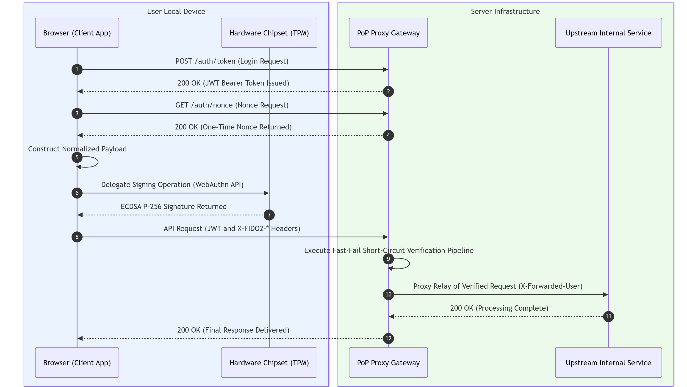

# Design and Performance Analysis of a FIDO2 Hardware-Isolated Key-Based Proof-of-Possession Reverse Proxy Gateway

**Ahrum Kang**  
*September 8, 2026*

---

## Abstract

Bearer tokens and software-based Demonstrating Proof-of-Possession (DPoP) specifications cannot fundamentally defend against private key exfiltration and session hijacking in environments where tokens are stolen or runtime memory is compromised. This paper proposes a Proof-of-Possession (PoP) gateway architecture that combines the FIDO2 specification—which physically isolates private keys within hardware security chipsets—with an L7 reverse proxy.

The proposed system normalizes requests through a streaming digest pipeline to prevent memory overload from large payloads, and applies a sliding window ingress control mechanism with $O(1)$ time complexity to block unauthorized bulk traffic. Elliptic curve signature verification is also delegated to an asynchronous thread pool to maximize concurrent request handling on a single node. Performance evaluation results show that the proposed ECDSA P-256 signature binding suppresses latency overhead to an average of **+25.65%** compared to standard token verification, and reduces HTTP header payload by 50% compared to RSA-2048. Furthermore, through concurrency optimization, a throughput of 780 requests per second (RPS) was achieved even under a load of 100 virtual users, demonstrating the effectiveness of high-load traffic defense and the practical applicability of the proposed system.

---

## I. Introduction

In web application and microservice architecture environments, bearer tokens are commonly used as the primary authentication mechanism due to the ease of stateless verification [1]. The bearer token model treats any network entity that presents a token as its legitimate owner. Consequently, if a token is leaked through cross-site scripting (XSS), credential-stealing malware, or unauthorized browser extensions, a third party can reuse it to access backend resources.

The Demonstrating Proof-of-Possession (DPoP) specification, which prevents token reuse at the software layer, requires an asymmetric signature on every request [2]. However, it has a structural limitation in that cryptographic keys are stored in browser local storage or application memory. If the host operating system is compromised or a memory dump occurs, the stored private key can be extracted, rendering the cryptographic defenses ineffective.

This paper proposes an architecture that combines the FIDO2 specification—which stores private keys in hardware-isolated devices—with a reverse proxy gateway. The client attaches a digital signature generated inside a hardware chipset to an HTTP header and transmits it; the gateway verifies the signature's validity before forwarding the request, defending against session hijacking.

The research contributions of this paper are as follows:

1. **Design of a Hardware-Isolated PoP Gateway Architecture**
   A verification pipeline is designed by combining FIDO2 hardware security chipsets with an L7 reverse proxy, defending against private key exfiltration and session hijacking even when the host operating system is compromised.

2. **Design of a Resource-Controlled and Concurrency-Optimized Architecture**
   A streaming digest structure is designed to prevent memory overload from large request bodies. In addition, an $O(1)$ time-complexity ingress control mechanism and an asynchronous thread pool are applied to block unauthorized bulk traffic and maximize throughput under high-load conditions.

3. **Empirical Demonstration of Quantitative Latency and Payload Overhead**
   The latency increase of the proposed architecture relative to standard token verification is measured, and the header payload overhead across asymmetric signature algorithms is compared to validate the practical applicability of the proposed system.

---

## II. Background and Related Work

### 1. Web Authentication Tokens and Key-Binding Specifications

The bearer token specification in the OAuth 2.0 authorization framework only verifies the cryptographic signature of the token itself; it does not verify whether the request sender is the legitimate entity to whom the token was issued. DPoP introduces a sender-constrained token model that requires each HTTP request header to include an asymmetric signature generated by the client. However, the DPoP standard does not mandate hardware binding of keys. Therefore, if an attacker gains access to the persistent storage or runtime memory of the user's device, the private key may be leaked.

Mutual Transport Layer Security (mTLS) constrains the sender using a client certificate [3]. Since mTLS performs a cryptographic handshake at the L4 transport layer, end-to-end authentication information becomes fragmented in microservice environments that traverse multiple reverse proxies or L7 application load balancers (ALBs). Furthermore, the web browser sandbox does not provide a standard JavaScript interface to control client certificates, limiting its applicability.

### 2. The FIDO2/WebAuthn Standard and Hardware Isolation Architecture

FIDO2 consists of the W3C's WebAuthn specification [4] and the FIDO Alliance's CTAP2 specification [5]. This standard uses Trusted Platform Modules (TPMs) embedded in client devices [8], smartphone Secure Enclaves, and external security tokens as hardware authenticators.

Hardware authenticators generate and store asymmetric key pairs directly within their internal logic circuits. The operating system and browser delegate signing operations to the hardware via an API, and the hardware returns only the resulting signature to the external bus. No instruction exists to extract a private key from within the chipset. Therefore, even if an attacker gains kernel-level access to the host operating system, the private key cannot be exfiltrated.

### 3. Cryptographic Characteristics: ECDSA P-256 vs. RSA-2048

The choice of digital signature algorithm directly affects transmission payload size and the gateway's computational cost. The RSA algorithm relies on the computational difficulty of factoring the product of two primes. Consequently, key lengths must be increased to maintain security strength. In contrast, Elliptic Curve Cryptography (ECC) [10], based on the Elliptic Curve Discrete Logarithm Problem (ECDLP), provides equivalent security strength with smaller key sizes.

| Metric | RSA-2048 | ECDSA P-256 |
|---|---|---|
| Cryptographic security level | ~112 bits | 128 bits |
| Public key size (raw) | 256 Bytes | 64 Bytes (uncompressed) / 33 Bytes (compressed) |
| Signature data size | 256 Bytes | ~64 Bytes ($(r, s)$ pair) |
| HTTP header encoding overhead | ~499 Bytes | ~252 Bytes |

In a PoP gateway environment, a signature is included in the header of every HTTP request, causing transmission overhead to accumulate. Since ECDSA P-256 reduces header size by 50% compared to RSA-2048 while providing a higher security level, it is the appropriate signature algorithm for this research.

---

## III. Threat Model and Attack Scenarios

### 1. System Model and Attacker Capability Definition

This research extends the Dolev-Yao attack model [7] to define attacker capabilities at the network and host layers. The attacker is assumed to eavesdrop on, tamper with, inject into, and delay network traffic between the client and the gateway. Additionally, at the host layer, the attacker is assumed to access browser storage or user-space memory of the operating system to obtain runtime tokens and session artifacts. However, physical attacks—such as dismantling the physical shielding of hardware chipsets like TPMs or Secure Enclaves to directly manipulate circuitry—are excluded from this research's threat scope.

### 2. Target Attack Vectors and Threat Scenarios

The primary threat scenarios the system defends against are as follows [9]:

1. **Session Hijacking**
   An attacker exploits an XSS vulnerability to obtain a client's valid JSON Web Token (JWT) and then includes it in an unauthorized request sent to the server.

2. **Request Tampering**
   A man-in-the-middle attacker intercepts a client's signed HTTP request and modifies the HTTP method, URI path, or body payload before forwarding it.

3. **Replay Attack**
   An attacker duplicates a captured valid signature header and the entire request packet, retransmitting it to the server to re-execute the same transaction.

4. **Asymmetric Cryptographic Denial-of-Service (DoS)**
   Asymmetric key signature verification consumes significantly more CPU resources than symmetric key or hash operations. An attacker sends a large volume of invalid signatures to saturate the gateway's cryptographic computation load.

---

## IV. System Architecture and Design

### 1. Overall System Configuration and Processing Flow

The proposed system consists of the hardware security domain on the user's local device and a server-side L7 reverse proxy gateway. The client includes browser software and a hardware chipset integrated into the motherboard, while the server infrastructure consists of a FastAPI-based reverse proxy gateway and a backend upstream service.

The client undergoes an authentication procedure to sequentially receive a JWT and a one-time nonce. It then serializes the HTTP request context and passes it to the hardware chipset, receives the digital signature generated by the internal logic circuits, and attaches it to the request header. The gateway verifies the incoming packet and forwards only valid requests to the upstream service.

### 2. HTTP Request Context Normalization and Streaming Digest

To prevent man-in-the-middle attackers from tampering with the request path or payload, the gateway and client combine the key fields of an HTTP request into a single byte sequence for normalization. In particular, to satisfy Financial-grade API (FAPI) security requirements, the binding scope is extended beyond the HTTP method and path to include query string parameters. The normalization payload ($SigningPayload$) is defined as follows:

$$SigningPayload = Method \parallel Path \parallel Query \parallel \text{SHA-256}(Body) \parallel Nonce \parallel Timestamp$$

To prevent memory overload on the gateway when processing large request bodies, a streaming digest pipeline is applied. This mechanism assumes an environment that supports HTTP chunked encoding or stream I/O at the proxy layer. Rather than loading the entire payload into a single memory buffer, the gateway immediately updates the hash function with incoming network byte stream chunks. This fixes the additional memory allocation at the signature verification layer to 32 bytes, maintaining $O(1)$ space complexity.

### 3. Fast-Fail Short-Circuit Verification Pipeline

Asymmetric cryptographic signature verification requires significantly more CPU cycles than string comparison or hash operations. To prevent asymmetric resource exhaustion attacks where computational load accumulates from invalid requests, the gateway applies a Fast-Fail pipeline that evaluates items sequentially from lowest to highest verification cost.

1. **Header Integrity Verification**: Checks for the presence of required authentication headers and returns a $401$ status code if any are missing.

2. **Timestamp Validity Range Evaluation**: Checks whether the request timestamp falls within the allowed tolerance window to exclude expired requests.

3. **One-Time Nonce Validation**: Checks whether the nonce exists in the store, then immediately deletes it to defend against replay attacks.

4. **Body Digest Comparison**: Compares the streaming SHA-256 hash of the received body against the digest presented by the client to check for a match.

5. **Asymmetric Cryptographic Signature Verification**: Verifies the mathematical validity of the ECDSA P-256 signature only for requests that have passed all previous stages.

The integrity and replay prevention effectiveness of this mechanism are demonstrated by the simulated attack verification results in Section V.

### 4. Dual Ingress Control Mechanism

A two-tier defense system is configured to protect the nonce issuance endpoint and the in-memory state store.

1. **Sliding Window Ingress Control**

   An in-memory sliding window algorithm tracks request frequency per client IP. Requests exceeding 10 per second from a single IP receive a $429$ status code and a retry response header. To prevent lock contention during multiple simultaneous incoming requests, state is managed using a $O(1)$ double-ended queue, minimizing the time spent in the critical section.

2. **Nonce Store Lifecycle Management and Garbage Collection**

   All issued nonces are assigned a Time-To-Live (TTL) of 60 seconds. A background task periodically deletes expired entries to prevent long-term memory leaks and state accumulation. A mutual exclusion lock is applied for atomic access control in a multithreaded environment.

The blocking effectiveness of this control mechanism is evaluated in Section V through unit and load simulation results.

---

## V. Implementation and Performance Evaluation

### 1. Experimental Environment and Prototype Implementation

A prototype system was built using Python 3.11 and the FastAPI framework to empirically validate the performance and security effectiveness of the proposed PoP reverse proxy gateway. The gateway operates on an asynchronous I/O event loop and is connected via a loopback interface to an upstream server simulating a backend microservice environment.

For the client-side hardware signing environment, a simulation client was implemented based on NIST P-256 asymmetric key pairs [6] conforming to the W3C WebAuthn Level 3 specification [4]. Experiments were conducted on a system with an Intel Core i7 processor and 16 GB of memory. Mean values represent averages over 100 independent, consecutive HTTP transactions on a single process [11].

### 2. Security Validation via Simulated Attack Scenarios

To validate the defense capability of the threat model defined in Section III, we developed four scenario-specific attack scripts and conducted the following experiments.

| Attack Scenario | Incoming Packet Condition | Gateway Response Code | Blocking and Processing Stage |
|---|---|---|---|
| Normal Request (Baseline) | Valid JWT and FIDO2 signature header | $200\text{ OK}$ | Forwarded after passing all 5 stages |
| Session Hijacking | Stolen JWT sent alone (signature missing) | $401\text{ Unauthorized}$ | Stage 1 (header verification) |
| Replay Attack | Re-sent signature containing a previously used nonce | $401\text{ Unauthorized}$ | Stage 3 (nonce store) |
| Request Tampering | Signature sent after tampering with method or body | $403\text{ Forbidden}$ | Stage 5 (signature mismatch) |

The experimental results confirmed that the gateway blocked session hijacking attacks—where only the JWT was stolen—at Stage 1 signature header verification. Replay attacks using sniffing were also eliminated prior to cryptographic computation via the Stage 3 nonce cache consumption mechanism. Furthermore, packets with a tampered HTTP method or body payload were identified by a normalization digest mismatch and returned a $403$ status code at the signature verification stage. This demonstrates that the Fast-Fail pipeline preemptively blocks invalid packets before expensive cryptographic operations.

### 3. Blocking Effectiveness Evaluation of the Ingress Control Mechanism

The operation of the sliding window ingress control was validated by simulating an L7 traffic surge attack against the nonce issuance endpoint.

15 consecutive nonce issuance requests were sent from the same IP address within a one-second window. For normal requests up to the threshold of 10, the gateway issued cryptographic nonces with a $200$ response. From the 11th request onward, the gateway returned a $429$ status code and a retry response header according to the time-decrement logic of the internal window queue. This confirmed that unnecessary nonce generation operations and memory loading overhead are blocked effectively.

### 4. Processing Latency and Payload Overhead Measurement

To analyze the performance cost of adding the security layer, the round-trip latency and HTTP header size of 100 requests were measured across three modes: standard token verification (Mode A), RSA-2048-based PoP (Mode B), and the proposed ECDSA P-256-based PoP (Mode C).

| Verification Mode | Mean Latency | 95th Percentile Latency (P95) | Additional Header Payload | Relative Latency Overhead |
|---|---|---|---|---|
| **Mode A (Standard JWT)** | 4.29 ms | 6.54 ms | 0 Bytes | Baseline |
| **Mode B (RSA-2048)** | 5.86 ms | 9.19 ms | 499 Bytes | +36.73% |
| **Mode C (ECDSA P-256)** | 5.39 ms | 6.54 ms | 252 Bytes | +25.65% |

Mode C incurred a mean latency overhead of 1.10 ms (+25.65%) compared to Mode A, demonstrating performance suitable for real-time web traffic environments. At the 95th percentile latency—representing the maximum latency for the top 5% of requests—Mode C recorded 6.54 ms, identical to Mode A, indicating stable performance. In contrast, Mode B's P95 latency was the highest at 9.19 ms.

In terms of payload, Mode B incurred 499 bytes of header overhead due to its fixed 256-byte signature size and Base64 encoding expansion, while Mode C reduced overhead to 252 bytes through a 64-byte signature coordinate structure. This confirmed a 50% payload reduction compared to RSA.

### 5. Throughput Evaluation Under Concurrent Load and Concurrency Optimization

A concurrent load test was conducted to validate the applicability of the proposed system in a production environment. Using a load generation tool, 100 virtual users continuously sent requests containing FIDO2 signature headers for 15 seconds. Concurrency architecture optimizations were also applied to resolve the bottleneck of a single-threaded event loop, and their effects were measured.

| Metric | Original Architecture (Before) | Optimized Architecture (After) | Performance Improvement |
|---|---|---|---|
| Concurrency Model | Synchronous Blocking (single loop) | Asynchronous Non-blocking (thread pool) | — |
| Ingress Lock Complexity | Array-based $O(N)$ operation | Double-ended queue $O(1)$ operation | — |
| Concurrent Throughput (RPS) | ~145 req/s | ~780 req/s | +437% |
| Mean Response Latency | 620 ms | 45 ms | −92% |
| 95th Percentile Latency (P95) | >1,400 ms (timeout) | 78 ms | −94% |

The original gateway architecture had a bottleneck where the event loop was blocked during CPU-intensive elliptic curve signing operations. This was resolved by delegating operations to an asynchronous thread pool and leveraging the cryptographic library's behavior of releasing the Global Interpreter Lock (GIL) during computation, enabling multi-core parallel processing even within a single process. The ingress controller's in-lock operations were also redesigned to $O(1)$ to reduce time spent in the critical section. As a result, the optimized architecture increased requests-per-second (RPS) throughput by 437% and reduced P95 latency by 94% compared to the original. Even when the threshold was exceeded, the gateway immediately returned a $429$ status code without response delay, demonstrating its suitability for large-scale traffic defense.

---

## VI. Discussion and Future Work

### 1. Summary of Research Results

This research proposed and implemented a Proof-of-Possession reverse proxy gateway integrated with FIDO2 hardware-isolated asymmetric keys to address the vulnerabilities of bearer token theft and session hijacking in web environments.

The core contributions and empirical results of the system are as follows:

1. **Design of a Hardware-Isolated PoP Gateway Architecture**: A verification architecture was established by combining hardware security chipsets with an L7 reverse proxy, defending against private key exfiltration and session hijacking even in the event of memory dumps or privilege compromise of the host device.

2. **Resource Control and DoS Defense Optimization**: $O(1)$ space complexity at the signature verification layer was maintained through streaming-based digest processing for large request bodies. Furthermore, invalid requests and L7 ingress attacks were blocked prior to asymmetric cryptographic computation via the Fast-Fail pipeline and sliding window ingress control.

3. **Empirical Demonstration of Quantitative Latency and Payload Overhead**: Benchmark measurements confirmed that the proposed Mode C incurs only a +25.65% latency increase compared to standard token verification. After concurrency optimization, a throughput of 780 RPS was achieved even under a load of 100 virtual users, demonstrating effective high-load traffic defense. Additionally, a 50% reduction in header payload size compared to RSA-2048 was confirmed, indicating suitability for bandwidth-constrained environments.

### 2. Limitations of the Research

The limitations of the implementation and validation environment in this research are as follows:

1. **Software Emulation-Based Client Signing**: The client-side hardware signing environment was validated using a software emulator conforming to the W3C WebAuthn Level 3 specification. The bus I/O latency and driver-layer overhead that occur when using an actual physical TPM 2.0 or physical security token were not reflected in the measurements.

2. **Scalability Constraints of Single-Node In-Memory Architecture**: The nonce cache and sliding window ingress controller of the proposed system were designed based on thread safety within a single process. Therefore, when horizontally scaling to multiple gateway instances behind a load balancer, state inconsistency issues between instances would arise.

### 3. Future Research Directions

We plan to conduct the following follow-up studies to overcome the above limitations and deploy the proposed architecture in a production environment:

1. **Physical Hardware Security Module Integration and Measurement**: The actual WebAuthn API will be invoked in a commercial web browser environment to operate the built-in security chipset and external FIDO2 tokens of client devices, analyzing end-to-end latency including the signature generation delay of physical chipsets.

2. **Distributed State Store and Atomic Verification Pipeline Construction**: To support horizontal scaling environments, the in-memory store will be migrated to a distributed cache cluster. Atomic script execution-based single-use verification techniques will be researched to prevent race conditions on one-time nonces across multiple nodes.

3. **Public Key Registration Protocol and Key Rotation Policy Research**: An authorization protocol for securely pre-registering public keys generated by hardware chipsets with the gateway will be designed, along with lifecycle management policies for immediately revoking and renewing existing key pairs upon cryptographic key expiration or device loss.

---

## References

[1] M. Jones and D. Hardt, "The OAuth 2.0 Authorization Framework: Bearer Token Usage," RFC 6750, Oct. 2012. DOI: 10.17487/RFC6750.

[2] D. Fett, B. Campbell, J. Bradley, T. Lodderstedt, M. Jones, and D. Waite, "OAuth 2.0 Demonstrating Proof-of-Possession at the Application Layer (DPoP)," RFC 9449, Sep. 2023. DOI: 10.17487/RFC9449.

[3] B. Campbell, J. Bradley, N. Sakimura, and T. Lodderstedt, "OAuth 2.0 Mutual-TLS Client Authentication and Certificate-Bound Access Tokens," RFC 8705, Feb. 2020. DOI: 10.17487/RFC8705.

[4] W3C, "Web Authentication: An API for accessing Public Key Credentials Level 3," W3C Candidate Recommendation Snapshot, 2023. [Online]. Available: https://www.w3.org/TR/webauthn-3/

[5] FIDO Alliance, "Client to Authenticator Protocol (CTAP) Implementation Draft," FIDO Alliance Proposed Standard, 2021. [Online]. Available: https://fidoalliance.org/specs/fido-v2.1-ps-20210309/fido-client-to-authenticator-protocol-v2.1-ps-20210309.html

[6] National Institute of Standards and Technology (NIST), "Digital Signature Standard (DSS)," Federal Information Processing Standards Publication (FIPS PUB) 186-5, Feb. 2023. DOI: 10.6028/NIST.FIPS.186-5.

[7] D. Dolev and A. C. Yao, "On the security of public key protocols," IEEE Transactions on Information Theory, vol. 29, no. 2, pp. 198–208, Mar. 1983. DOI: 10.1109/TIT.1983.1056650.

[8] Trusted Computing Group (TCG), "TPM 2.0 Library Specification," TCG Published Standard, Revision 1.59, 2019. [Online]. Available: https://trustedcomputinggroup.org/resource/tpm-library-specification/

[9] OWASP Foundation, "OWASP API Security Top 10 2023," Tech. Rep., 2023. [Online]. Available: https://owasp.org/API-Security/

[10] N. Koblitz, "Elliptic curve cryptosystems," Mathematics of Computation, vol. 48, no. 177, pp. 203–209, 1987. DOI: 10.1090/S0025-5718-1987-0866109-5.

[11] R. Jain, The Art of Computer Systems Performance Analysis: Techniques for Experimental Design, Measurement, Simulation, and Modeling, John Wiley & Sons, 1991.
